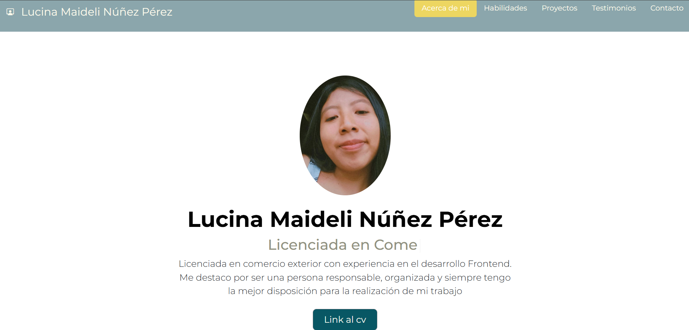
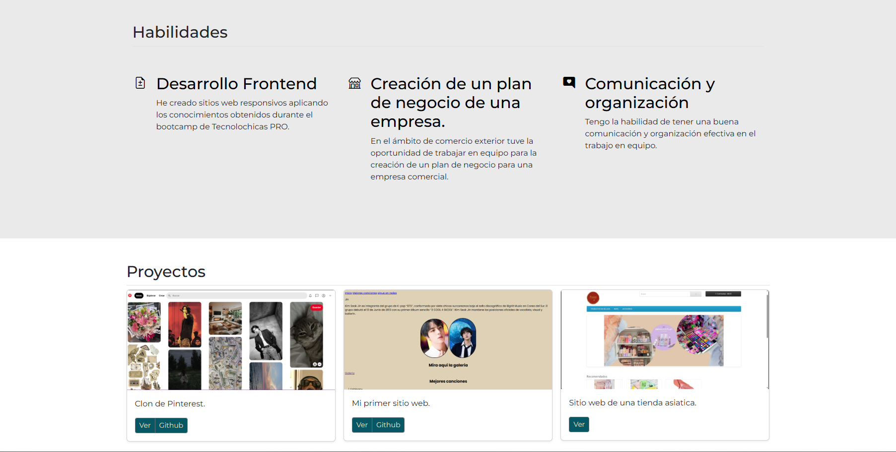
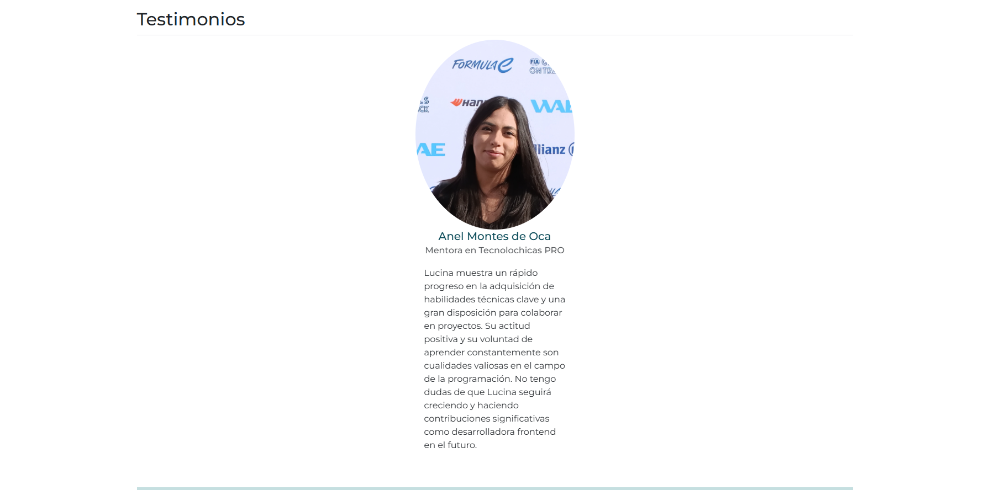
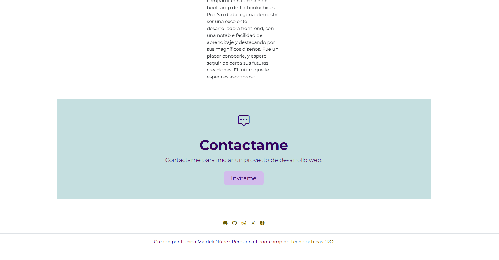

## Portafolio de proyectos

¡Hola! soy **Lucina Maideli Núñez Pérez**, soy *licenciada en comercio exterior y  desarrolladora web Jr*, aqui encontraras información sobre mi.  

____
## El proyecto cuenta con las secciones de:

- 💪 Habilidades 
- 📂 Proyectos 
- 💭 Testimonio
- 📧 Información de contacto

### Creado con:
- HTML
- CSS
- JavaScript

    
    
### Vista Previa

### *Espero pronto saber de ti, puedes escribirme al correo electrónico* ###

*Correo electrónico*
lucinanunez32@gmail.com

____

### Creado en el Bootcamp de Tecnolochicas Pro🧡💙
[Tecnolochicas](https://tecnolochicas.mx/)

